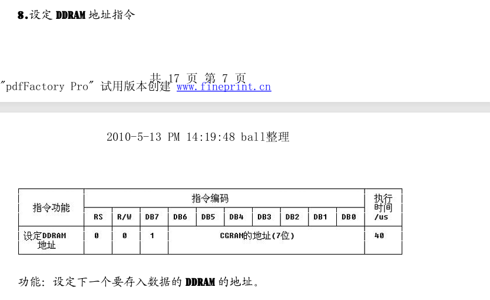
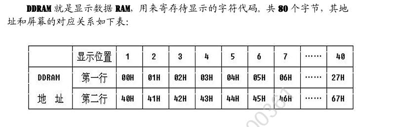
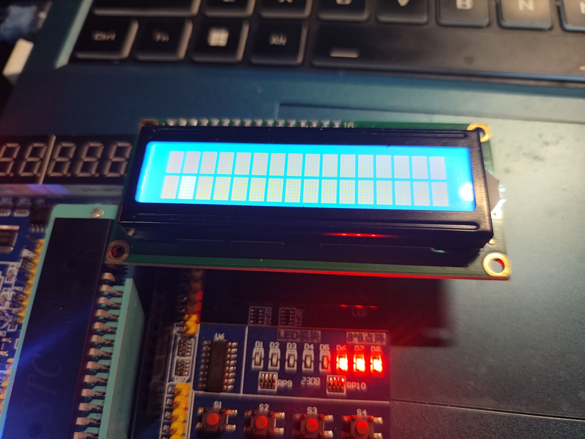
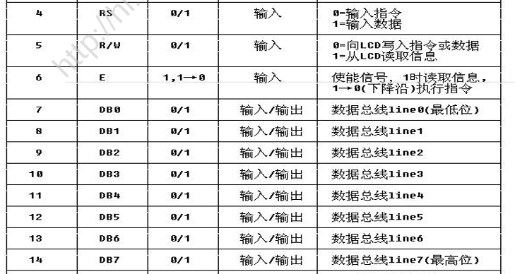
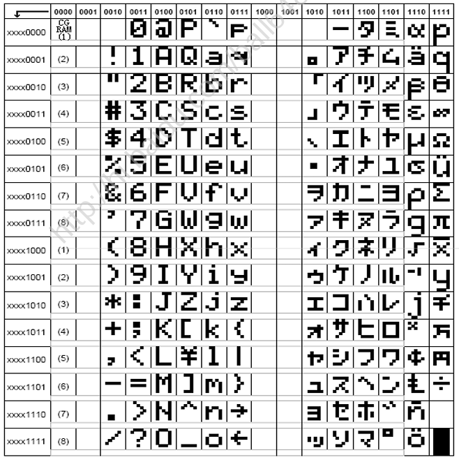
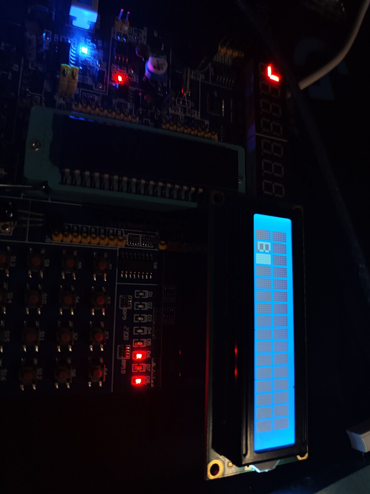
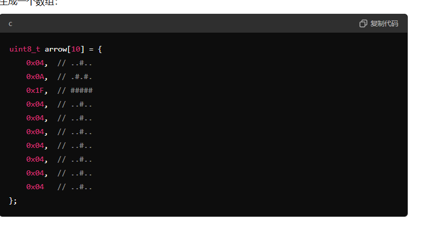
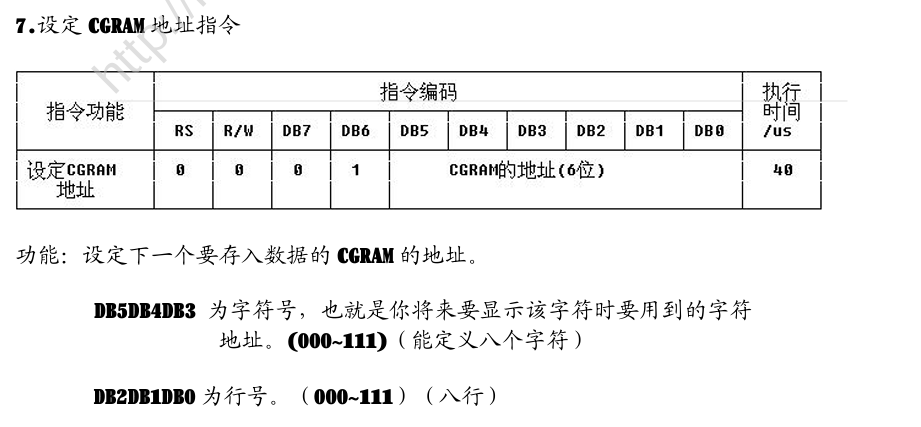
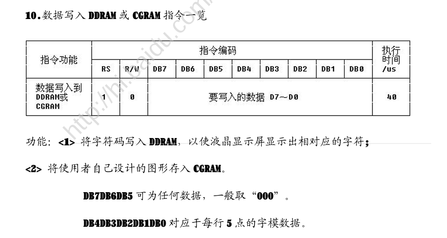
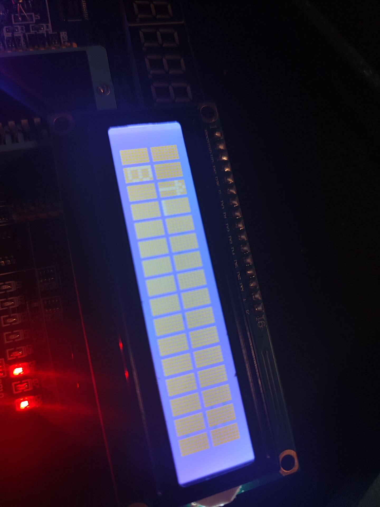

#  LCD驱动开发

1.了解LCD和原理图

2.先对LCD的端口进行定义


```
如图，可以看到LCD的WR，RS，EN引脚分别接芯片的P25、P26、P27，为了含义简单，可以进行重新定义
```

```c
#include "LCD_1206.h"
//读写引脚，数据命令引脚，使能引脚定义
sbit LCD_RW=P2^5;
sbit LCD_RS=P2^6;
sbit LCD_EN=P2^7;
//输入引脚定义
#define LCD_INPUT_PORT P0
typedef unsigned char u_char;//书写更简单
```

### 接下来开始写第一个功能函数，清空屏幕

查阅手册可以看见这里


```
可以看见，若将RS设置为1，将Rw设置为0，输入设置为0000 0001，即可清除屏幕
即LCD_INPUT_PORT=0x01;
但是考虑到指令的执行需要时间，所以这里加一个延时，保证在该指令执行完成前不会再对LCD传入指令
```

延时函数

```C
//延时函数
void Delay_100us(unsigned int times) // 接受微秒数作为参数
{
    unsigned char i;
    while (times--) // 每次循环减少一个微秒
    {
        i = 47; // 计算在12.000MHz下一个微秒所需的循环次数
        while (--i);
    }
}


```

接着清空函数

```C
void LCD_clearAll(void)
{
	LCD_RW=0;	//设置为写
	LCD_RS=0;	//设置为指令模式
	LCD_INPUT_PORT=0x01;// 设置写入的值
	//下降沿让值生效
	LCD_EN=1;					//高电平
	Delay_99us(1);			//延时保证电平稳定
	LCD_EN=0;					//低电平，产生了下降沿
	Delay_99us(10);//延时保证在这期间不会在对LCD操作，保证LCD完成指令，期间EN不被再次打开
}	
```

可以发现，自己去手动实现这11个指令非常麻烦，所以我们可以写一个指令函数

```C
void LCD_Command(u_char CMD)
{
	LCD_RW=0;	//设置为写
	LCD_RS=0;	//设置为指令模式
	LCD_INPUT_PORT=CMD;// 设置指令
	//下降沿让指令生效
	LCD_EN=1;					
	Delay_100us(1);		
	LCD_EN=0;					
	Delay_100us(1);
}

```

## 接着实现初始化函数

首先设置显示器开关


```C
我们设置显示功能开，有光标，光标闪烁 ，即为LCD_INPUT_PORT赋值0000 1110 ，即0x0E
PS:经过验证，发现设置B值为1才是光标闪烁，所以输入值应该为0x0F！！！
```


然后设置功能


```
可以看到，我们的屏幕是2行屏幕，数据总线为8位，每个字符为5x10点阵所以我们设置LCD_INPUT_PORT为0011 11xx，x为任意值，我们这里就设置为0x39
即LCD_Command(0x39)
```

然后设置光标移动指令


```
我们设置写一个字符光标就向右移动1为，所以值为0x06（后面也不再赘述）
```

最后清屏，就做好啦

```C

void LCD_Init()
{		
		LCD_Command(0x0F);	//设置显示功能开，有光标，光标闪烁
		LCD_Command(0x39);	//2行屏幕，8位数据线，显示格子5*10
		LCD_Command(0x06); 	//设置输入方式为光标右移
		LCD_clearAll();			//清屏
}
```

## 我们来实现第一个功能，移动光标，通过移动光标来确定书写地址

先看手册说明



```C
可以看见，DB7为1，也就是其他全为0时，DB7=1000 0000，设其他六个为x，则为1xxx xxxx，现在知道，1xxx xxxx为
（1000 0000 |0xxx xxxx）的结果。又看DDRAM地址图，如下
```



```
也就是说第一行第一列写，那么指令就是 1000 0000 +00H（0x80）,第二行第一列写，指令就是1000 0000+40H（0x80+0x40=0xc0）
以此类推。
然后就是函数，移动光标到这里，有两个参数，行和列。
# 已知我们设备属性，2行16列。
也就是说，先判断是否在16列内，再判断是否在1行还是2行（先判断行再判断列也没有问题）
代码如下
```

```C
//设置字符的书写位置
void LCD_setAddress(u_char rows,u_char cols)
{
	//先判断是否在1-16列
	if(cols<=16&&cols>=1)
	{
		//判断行数
		if(rows==1)
		{
				
		}
		else if(rows==2)
		{
			
		}
	}
}
```

### 接下来写指令

```C
当为1行x列时，指令为0x80(DB7为1）+00H(第一行起始地址)+（x-1）=0x80|(x-1);//可以自己计算一遍
 同理2行x列，指令为0x80+40H+（x-1）=0xC0|(x-1);
                为什么要x-1，因为在没加列数之前，就已经代表了第一列地址，比如0x80本身就是一行一列地址。
```

最后完整代码

```C
//设置字符的书写位置
void LCD_setAddress(u_char rows,u_char cols)
{
	//先判断是否在1-16列
	if(cols<=16&&cols>=1)
	{
		//判断行数
		if(rows==1)
		{
				LCD_Command(0x80|(cols-1));
		}
		else if(rows==2)
		{
				LCD_Command(0xC0|(cols-1));
		}
	}
}
```

## 下面开始检验

下面是函数调用

```C
#include <REGX52.H>
#include "LCD_1206.h"

void main(void)
{
	LCD_Init();
	LCD_setAddress(2,2);
	
	while(1)
	{
	}
}

```



- 可以看见，光标真的移动到2行2列了！

### 下面开始开发写数据功能

```
首先明白一点，写数据不是指令，所以在指令表里是查不到的，我们直接写就行了，里面会自动转换为对应编码，参考指令表，有下图
```




```
写数据为 
Rs=1;
Rw=0;
DB线为数据对应的编码
```

```
看编码表
```



```
比写个B，只需要DB=0x42;其他字符同理
#  ps：但是我们传参能不能直接传'B'呢，答案是可以的，因为他们的本质还是编码，无论是ASCll编码还是其他编码，其原理都是通过编号显示对应的字符，我们只要保证我们编译出来的hex文件中，里面的字符解析格式和这个编码表统一就行。我们在选择开发环境时，设置过为c51单片机，还有型号等等，就是告诉编译器编译时怎么编译，按照什么格式编译。下面开始写函数
```

```
首先，函数参数，写的数据，其次函数名：LCD_writeData，开干！
```

```C
void LCD_writeChar(char ch)
{
	LCD_RW=0;	//设置为写
	LCD_RS=1;	//设置为数据模式
	LCD_INPUT_PORT=ch;
	LCD_EN=1;					
	Delay_100us(1);		
	LCD_EN=0;					
	Delay_100us(1);
}
```

### 开始实验

main函数

```C
#include <REGX52.H>
#include "LCD_1206.h"

void main(void)
{
	LCD_Init();
	LCD_setAddress(2,2);
	LCD_writeChar('B');
	while(1)
	{
	}
}

```

### 实验现象



### 成功显示B！

## 接下来是自定义字符，自己画自己的字库；

#### 首先是设置字符:



```
数组代码：
//@字符数组
u_char arrow[10] = {
    0x04,  // ..#..
    0x0A,  // .#.#.
    0x1F,  // #####
    0x04,  // ..#..
    0x04,  // ..#..
    0x04,  // ..#..
    0x04,  // ..#..
    0x04,  // ..#..
    0x04,  // ..#..
    0x04   // ..#..
};

```

接下来回到字符表


可以看见：0x00~0x0F都没人写，所以我们可以写在那里面



设计函数：

```
函数名 LCD_myCharAddress,参数 :u_char address u_char rows;
#计算命令为，0x40|地址|行号
```

### 函数结果

```C
//设置字符地址
void LCD_myCharAddress(u_char address, u_char rows)
{
	address*=8; //为后面补三个0
	LCD_Command(0x40|address|rows);
}

```

## 最后是写入函数



### 想必大家指令已经可以解读了，不再赘述

```C
//写入字符
void LCD_addMyChar(u_char address,u_char*arrow)
{
	u_char rows=0;
	for(rows=0;rows<8;++rows)
	{
		LCD_myCharAddress(address,rows);
		LCD_writeChar(arrow[rows]);
	}
}
```

## 调用：

```C
#include <REGX52.H>
#include "LCD_1206.h"


//@字符数组
u_char arrow[8] = {
    0x04,  // ..#..
    0x0A,  // .#.#.
    0x1F,  // #####
    0x04,  // ..#..
    0x04,  // ..#..
    0x04,  // ..#..
    0x04,  // ..#..
    0x04,  // ..#..
};
//@end

void main(void)
{
	LCD_Init();
	LCD_setAddress(2,2);
	LCD_writeChar('B');
	LCD_addMyChar(0x00,arrow);
	LCD_setAddress(1,3);
	LCD_writeChar(0x00);
	while(1)
	{
		
	}
}

```

## 现象



## 最后布置读取驱动开发作业，还有字符串显示作业


# 源码

## 1.头文件 LCD_1206.h

```C
#ifndef __LCD_1206_H
#define __LCD_1206_H


typedef unsigned char u_char;//书写更简单

void LCD_Command(u_char CMD);
void LCD_clearAll(void);
void LCD_Init();
void LCD_setAddress(u_char rows,u_char cols);				//设置字符的书写位置
void LCD_writeChar(u_char ch);												//写数据
//写入字符
void LCD_addMyChar(u_char address,u_char*arrow);
#endif
```

## 2.源文件LCD_1206.c

```C
#include <REGX52.H>
#include "LCD_1206.h"

//读写引脚，数据命令引脚，使能引脚定义
sbit LCD_RW=P2^5;
sbit LCD_RS=P2^6;
sbit LCD_EN=P2^7;
//输入引脚定义
#define LCD_INPUT_PORT P0


//延时函数
void Delay_100us(u_char times) 
{
    unsigned char i;
    while (times--) // 每次循环减少一个微秒
    {
        i = 47; // 计算在12.000MHz下一个微秒所需的循环次数
        while (--i);
    }
}

void LCD_Command(u_char CMD)
{
	LCD_RW=0;	//设置为写
	LCD_RS=0;	//设置为指令模式
	LCD_INPUT_PORT=CMD;// 设置指令
	//下降沿让指令生效
	LCD_EN=1;					
	Delay_100us(1);		
	LCD_EN=0;					
	Delay_100us(1);
}


void LCD_clearAll(void)
{
	LCD_RW=0;	//设置为写
	LCD_RS=0;	//设置为指令模式
	LCD_INPUT_PORT=0x01;// 设置写入的值
	//下降沿让值生效
	LCD_EN=1;					//高电平
	Delay_100us(1);			//延时保证电平稳定
	LCD_EN=0;					//低电平，产生了下降沿
	Delay_100us(10);//延时保证在这期间不会在对LCD操作，保证LCD完成指令，期间EN不被再次打开
}	

void LCD_Init()
{		
		LCD_Command(0x0F);	//设置显示功能开，有光标，光标闪烁
		LCD_Command(0x39);	//2行屏幕，8位数据线，显示格子5*10
		LCD_Command(0x06); 	//设置输入方式为光标右移
		LCD_clearAll();			//清屏
}
//设置字符的书写位置
void LCD_setAddress(u_char rows,u_char cols)
{
	//先判断是否在1-16列
	if(cols<=16&&cols>=1)
	{
		//判断行数
		if(rows==1)
		{
				LCD_Command(0x80|(cols-1));
		}
		else if(rows==2)
		{
				LCD_Command(0xC0|(cols-1));
		}
	}
}
//写入数据
void LCD_writeChar(u_char ch)
{
	LCD_RW=0;	//设置为写
	LCD_RS=1;	//设置为数据模式
	LCD_INPUT_PORT=ch;
	LCD_EN=1;					
	Delay_100us(1);		
	LCD_EN=0;					
	Delay_100us(1);
}


//设置字符地址
void LCD_myCharAddress(u_char address, u_char rows)
{
	address*=8; //为后面补三个0
	LCD_Command(0x40|address|rows);
}


//写入字符
void LCD_addMyChar(u_char address,u_char*arrow)
{
	u_char rows=0;
	for(rows=0;rows<8;++rows)
	{
		LCD_myCharAddress(address,rows);
		LCD_writeChar(arrow[rows]);
	}
}
```

 