# 外部中断和定时器

- ## 探究中断的核心---中断的思想

  ### 一、小故事

  从前有一个穷逼牛马大学生叫莫得前，一天莫得前在宿舍看电视，突然舍友回来了，给莫得前说，校门口的超市搞促销，全场一折，去晚了就卖光了（现在已经知道莫得前很穷），这对于莫得前来说是囤货的好机会（对莫得前来说这件事紧急且重要），所以莫得前就把电视暂停，准备买东西回来再看，当莫得前走到半路时，莫得前突然看见有人在路边晕倒了，情况非常危及，心地善良的莫得前就赶紧给120打了电话，等医生把人带走后，莫得前就去超市买东西，然后回宿舍点开电视继续看了。

  ## 二、故事分析

  ```
  在这个故事里，因为两次意外的事件，打断了没有前原本的工作，第一次是室友的消息，第二次是发现路边有人晕倒
  ```

  1. #### 外部中断的含义

  ```
  中断就是因外界的突发信号，打断原本任务的而去处理突发信号对应的事件过程。 
  ```

  | 序号 | 原本事件 | 突发信号     | 对应的事件  |
  | ---- | -------- | ------------ | ----------- |
  | 1    | 看电视   | 室友的消息   | 去买东西    |
  | 2    | 去买东西 | 发现路人晕倒 | 给120打电话 |

  #### 2.外部中断的流程

  ```
  处理原本事件->接收到突发信号->保留现场留置完成突发事件再处理->处理突发事件->恢复现场->处理原本的事件
  ```

  ###### PS：保留现场和恢复现场在故事中对应的就是暂停电视和出现打开电视。

  #### 3.外部中断的核心思想

  - 不可观测性：存在突发信号，且事件处理者不知道何时触发这个突发信号

    ```
    解释：在这里，没有前是不能预料到室友的消息和路人晕倒这些信号的发生时机的。只有他得知到这些外界信息后才能做出处理
    ```

  - 对应性：一个突发信号有且只能有一个对应的处理事件，不能一个信号对应0个事件，也不能一个事件对应多个事件

    ```
    解释：如果没有钱在看电视的过程中，室友突然说："今天吃饭好饱啊"。然而此信号与没有前没有相关性，没有前继续看电视。这个信号就是无效的，因为并不会对其处理，而是忽略掉。 
    为什么不能对应多个事件呢。有两个维度解释：
    1.如果是多个事件，没有前无法同时处理。比如叫没有前一边睡觉一边看电视，显然是不可能的。
    2.凡是能触发的，我们都可以理解为一个事件。比如没有钱从超市回来，没有前购物，没有前回到宿舍，本质上其实是一件事（购物），这三个事件是购物这个事件子事件而已。而且这三件事本身是具有流程的，不是同时进行的，所以看成一件事情
    ```

    

  - 可还原性：在处理信号对应的事件前，要保留现场，而在完成事件以后，要能够还原现场。

    ```
    解释：就像没有前在购物前暂停视频，在购物回来后打开视频，其实本质上就是一个保留现场和还原现场的过程。在计算机中，处理中断事件后，凭什么还能沿着开始的原本事件接着运行，就是因为在处理中断事件前进行了现场保留。
    重点！！！！-》在开发过程中，中断处理的事件不能破坏与现场相关的设备的环境，不然会导致程序出错！！！！！！！！！
    比如有一个突发信号，然后对应的事件就是破坏保留的环境，当中断事件结束后，程序是无法还原到最开始的状态的，那还咋运行。
    ```

  - 具有优先级：当中断事件在执行过程中，如果有优先级更高的信号触发，那么就再次保留这个事件的现场，执行优先级更高的中断事件，完成后回恢复现场到此中断事件，此中断事件执行完后又还原上一个现场，继续执行。

    ```
    解释：就是中断可以套娃。剥洋葱！
    ```

- ## 单片机中的中断

  中断核心思想掌握后，就很简单了。计算机也是满足上面几点。

#### 1.计算机中的中断系统，是独立于CPU的可编程硬件电路。

外部中断是一种可以编程的硬件电路，触发流程是写死了的，我们改不了的（除非你有能力让里面的电路按照你的思维改变--能手搓微电子电路，等着被切片研究吧），我们只能去按照要求修改触发的配置信息，比如能不能触发，何时触发，触发信号对应的事件。

#### 2.由于是硬件电路，所以有几个中断电路就是几个，叫啥名就是啥名，不能增加，下面以51单片机为例子

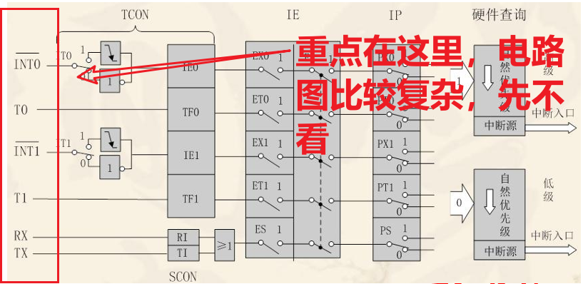

```
如图，51必定有的下面几个中断系统，分别是 INT0-外部中断1（这些都是给中断取的名字，下同），T0-定时器0，INT1 外部中断1，T1-定时器1，RXTX-串口中断（注意，虽然RX和TX是两个线路，但是他们控制的都是一个中断,不是分开的）
```

下面是说明表，帮助理解

PS：interrupt的英文意思是中断,External的英文意思是外部的,timer在这里是定时器的意思

| 名称    | 全名                    | 中文名称     | 功能                                             |
| ------- | ----------------------- | ------------ | ------------------------------------------------ |
| INT 0\1 | External Interrupt  0\1 | 外部中断 0\1 | 可以定义外部的信号实现中断效果                   |
| T 0\1   | Timer 0\1               | 定时器 0\1   | 可以通过设置事件实现中断，时间一到就发射中断信号 |
| RX TX   | Receive     Transmit    | 串口中断     | 串口有信号就中断                                 |

#### 3.单片机的中断运行流程。

```
单片机正常运行-》接受到外部中断的信号-》cpu保存当前上下文环境到堆栈-》cpu的执行地址切换到外部中断服务函数的入口地址-》执行外部中断函数-》完成外部中断函-》cpu的执行地址跳转到之前的堆栈中-》加载原本的上下文信息-》正常执行
```

这个外部中断服务函数的入口地址在硬件里是写死了的，当然也可以通过硬件地址重定位进行修改（要汇编语言）。

#### 4.中断的触发原理简单描述

```
其实非常简单，就是满足中断触发条件后有根电路会通电，中断系统就会给cpu发生中断请求，且会有一个标志位显示为触发状态，给cpu一个信号，cpu就去遍历所有中断的标志位，看看是谁要触发中断。(因为地址是写死的，所以遍历也是固定的，注：可以通过汇编重定位改变地址，后面不再赘述)
```


#### 5.中断组成

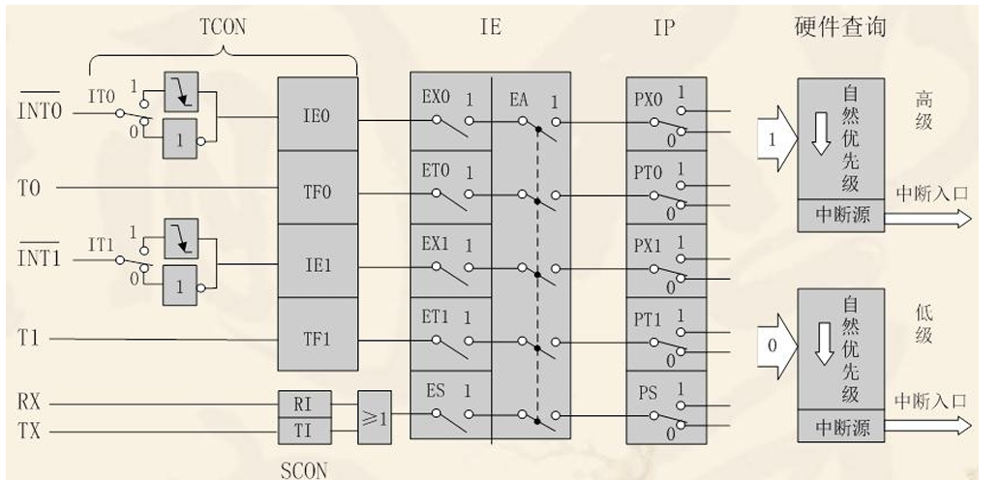

```
这个电路看起来及其复杂，特别是讨厌电路的朋友，所以我们直接简化，这里以INT0为例子,如图，首先我们只需要明白把这个电路设置好,这个中断的信号就能发给cpu了
#INT0->IT0->IE0->EX0->EA->PX0->硬件查询（轮询中断标志位，确定中断服务函数入口地址）-》执行中断
```

1. #### 配置IT之前，先看IT0的意思，如下图

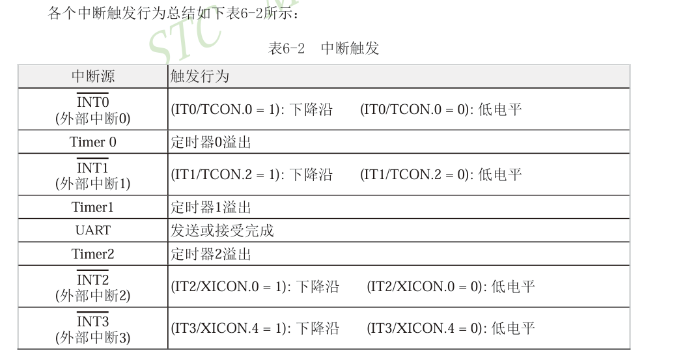

```
可以看到IT0（interrupt 0）的功能就是设置外部中断的触发方式，大白话就是在哪种情况下产生溢出，是高电平，低电平还是其他等等，比如没有前去超市的触发方式就是室友告诉打折信息，而这里我们可以自定义。比如我们要设置为低电平触发。就设置为IT0等于0。

但是有个问题，是谁的低电平会触发呢，IT0等于0怎么写代码呢?翻手册。
```

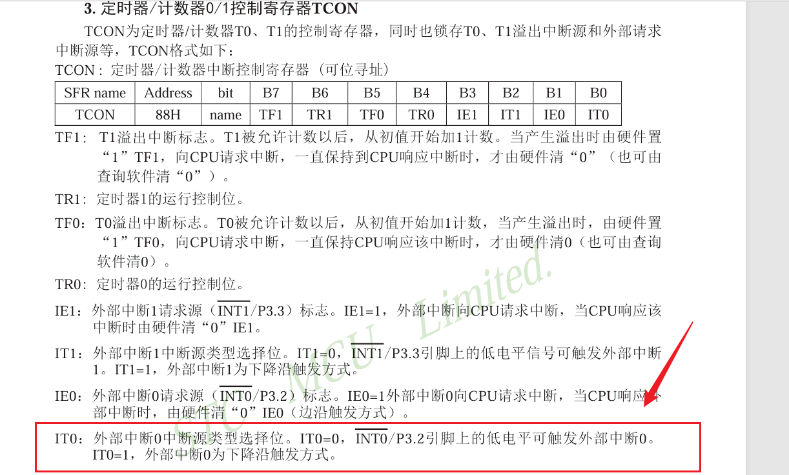

```
重点在这里，INT0是和P3.2绑定的（这是硬件电路，我们改不了的），所以P3.2低电平就会触发中断信号。
```

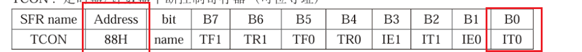

``` 
也就是说，设置地址88H的最低位为0即可，开始写代码。
先找头文件有没有88H地址的定义。
```

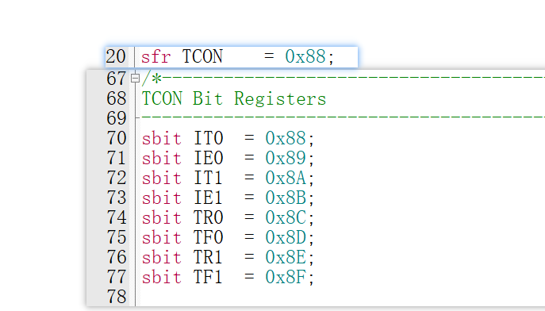

```C
因为TCON是可位寻址的，所以直接设置IT0=0;
下面是代码

void INT0_Init()
{
	IT0=0;
	
}
```

2. #### 设置IE0

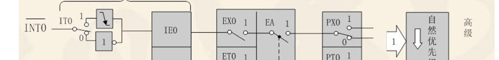

```
先了解IE0的定义：
```

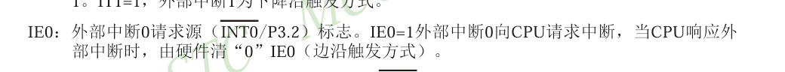

```
这个是中断标志位，当出现中断信号后，这里变为1.所以不需要设置，我们让电路低电平这里就为1了，但是我们得保证中断处理完后这里变为0，不然又会进行中断
```

#### 3.设置EX0 

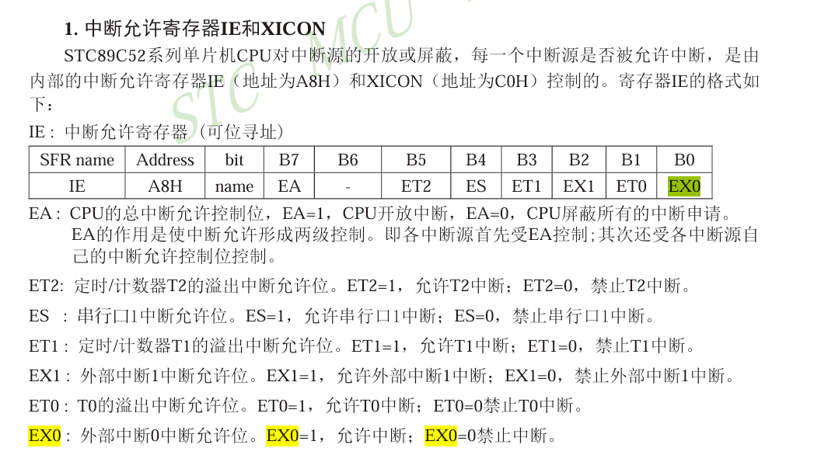

```C
简单来说就是确定是否使用中断。如果不使用中断功能（设为0），即使IE0=1也不会触发中断对应的事件。我们把他设置为1，下面是代码
void INT0_Init()
{
	IT0=0;
	EX0=1;
}
//代码是接着上面写的
```


#### 4.设置EA的功能

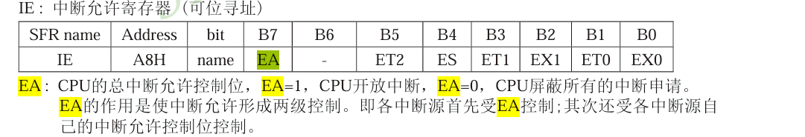

```
跟EX功能类似，也是是否启用中断功能，只不过这个是总控开关，如果不使用他，其他所有中断信号都无效，就如下图，如果不打开总控开关，其他所有开关打开都无效。
```

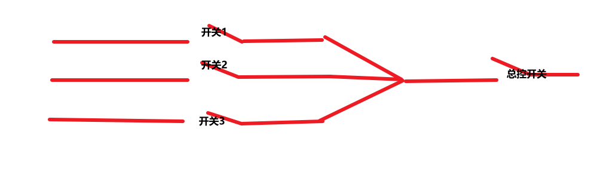

```C
现在把EA设置为1，下面是代码
    void INT0_Init()
{
	IT0=0;
	EX0=1;
	EA=1;
}//多个中断EA只需设置1次即可
```


#### 5.设置PX

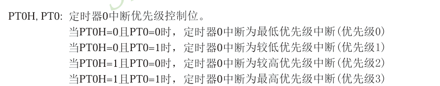

```C
说白了就是设置中断处理的优先级，比如看见路人晕倒这个信号，为什么比去购物更重要，不就是因为救人更重要嘛。对于计算机来说，你不去设置，他就不知道优先级，如果两个中断同时触发，那先执行谁啊？所以我们就要配置优先级。而优先级相同怎么处理呢？计算机硬件是写好了的，但是不建议两个事件优先级相同，因为不同硬件逻辑可能不一样，如果当时搞忘了翻手册，可能就会出错。
比如我们要把事件优先级设为1，那么PT0H=0；PT0=1；就好了，下面是完整的配置代码
sfr IPH =0xB7; //AT芯片没有，自己定义
void INT0_Init()
{
    IT0 = 1;    // 设置中断 0 为边沿触发
    EX0 = 1;    // 使能外部中断 0
		EA 	=	1;		//打开总控开关
		//优先级为高位优先级值*2+低位优先级
		IPH|=0x01;	//设置中断0的高位优先级为1；	
    PX0 = 1;    //设置中断0的低位优先级为0；
		EA = 1;
}

```


### 现在，只要我们按下按键，这个中断信号就会触发！

```
我们理一下逻辑，配置中断的流程：
确认中断信号的产生方式。
让中断有效
让cpu能处理中断 -总控开关
给中断一个优先级
```

# ！！！还有一个问题，中断信号是有了，那中断信号触发后，计算机做什么呢，对应的中断事件是什么呢？？？

```
回到CPU处理中断的流程:单片机正常运行-》接受到外部中断的信号-》cpu保存当前上下文环境到堆栈-》cpu的执行地址切换到外部中断服务函数的入口地址-》执行外部中断函数-》完成外部中断函-》cpu的执行地址跳转到之前的堆栈中-》加载原本的上下文信息-》正常执行
```

### 我们只需要把执行的任务写到对应的入口地址即可，因为硬件电路是写死的，所有中断触发后肯定是执行硬件电路对应的入口地址里的函数。在C51中，有一个关键字 interrupt  ，书写格式是：void 函数名（void） interrupt  中断序列号{函数执行的任务}

```
重点在于序列号是什么？序列号就是不同中断的入口地址的序号，这些是写死的。只要函数带这个参数，就会把这个函数写到中断的入口地址里去。
```

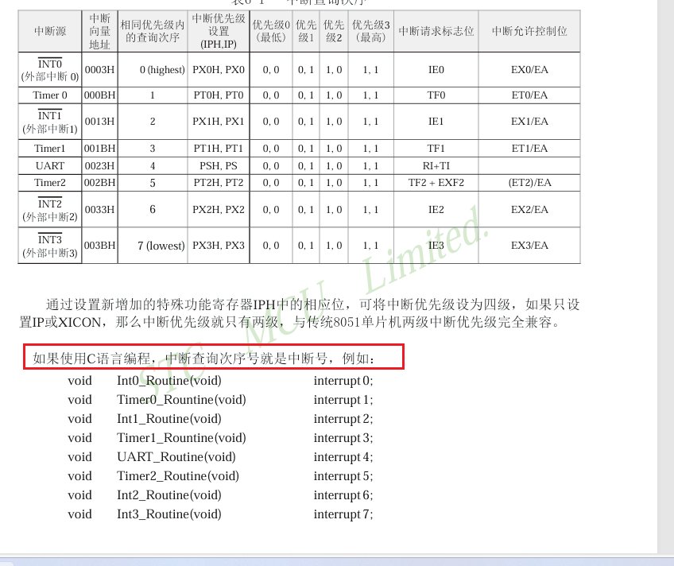

在这个芯片的说明文档里面，查询次序号就是中断号，所以我们这里中断号就是0。

```C
下面就是函数的写法。注意 返回值和参数只能是void，中断不能接受参数，也不能返回参数，但是可以使用全局变量或者让中断去执行另一个函数等等
void INT0_Interrupt(void) interrupt 0
{
	
	
	
}
```

比如实现一个数加一，然后显示，下面就是完整代码

```c
#include <REGX52.H>
#include "KEY.h"
#include "Delay.h"
#include "LCD_1206.h"

volatile  int value=0;


sfr IPH =0xB7; //AT芯片没有，自己定义
void INT0_Init()
{
    IT0 = 1;    // 设置中断 0 为边沿触发
    EX0 = 1;    // 使能外部中断 0
		EA 	=	1;		//打开总控开关
		//优先级为高位优先级值*2+低位优先级
		IPH|=0x01;	//设置中断0的高位优先级为1；	
    PX0 = 1;    //设置中断0的低位优先级为0；
		EA = 1;
}


//主函数
void main(void)
{
	INT0_Init(); //调用初始化中断
	LCD_Init();		//初始化LCD
	while(1)
	{
		LCD_writeNumber(value);
	}
}


//中断处理函数

void INT0_Interrupt(void) interrupt 0
{
	value++;
}
```

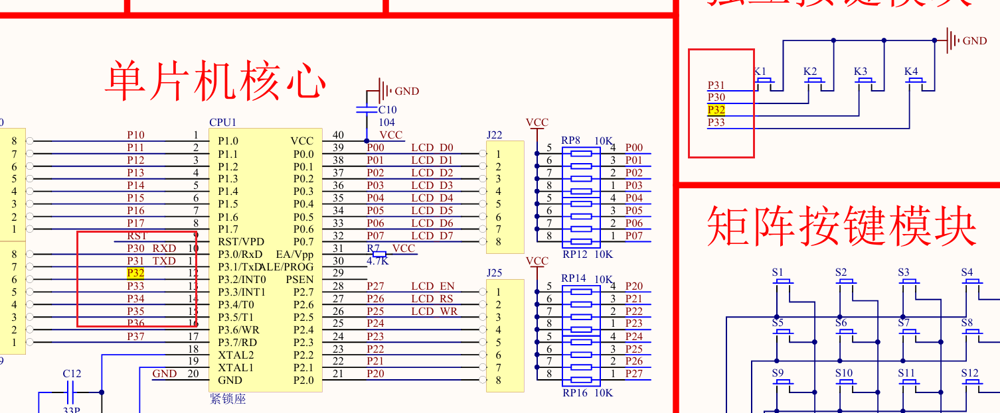

再看原理图，可以知道，按下P32，value就会+1；

但是最后显示发现一下越了好几位，怎么回事呢？

```C
void INT0_Init()
{
	IT0=0;
	
}
因为我们设置的TI0=0，是低电平触发，我们按下去一下就是好多个低电平信号了，只要不松手就一一直是低电平，我差点没反应过来。、
    所以应该把IT0=1;变成下降沿触发，这样按一次就只触发一次,下面是完整代码
```

```C
#include <REGX52.H>
#include "KEY.h"
#include "Delay.h"
#include "LCD_1206.h"


volatile  int value=0,LCD_upData=0;


sfr IPH =0xB7; //AT芯片没有，自己定义
void INT0_Init()
{
    IT0 = 1;    // 设置中断 0 为边沿触发
    EX0 = 1;    // 使能外部中断 0
		EA 	=	1;		//打开总控开关
		//优先级为高位优先级值*2+低位优先级
		IPH|=0x01;	//设置中断0的高位优先级为1；	
    PX0 = 1;    //设置中断0的低位优先级为0；
		EA = 1;
}


//主函数
void main(void)
{
	INT0_Init(); //调用初始化中断
	LCD_Init();		//初始化LCD
	while(1)
	{
		if(LCD_upData==1)
		{
			LCD_setAddress(1,1);	
			LCD_writeNumber(value);	
			LCD_upData=0;
		}
	}
}


//中断处理函数

void INT0_Interrupt(void) interrupt 0
{
	value++;
	LCD_upData=1;
}
```

# 定时器

#### 一通百通，定时器的原理也是一样，反正优先级配置逻辑都是一样的，只不过定时器的信号触发方式是计数触发，换一个配置方法而已

